# Biblioteca Central - Sistema de Gestión con Docker Compose

## Descripción del Proyecto

Este proyecto implementa un sistema de gestión de biblioteca completamente funcional utilizando Docker Compose. El stack está compuesto por cuatro servicios que se comunican entre sí a través de una red interna de Docker:

- **PostgreSQL** - Base de datos relacional con datos persistentes
- **Flask (Python)** - API REST con operaciones CRUD
- **pgAdmin** - Panel de administración de la base de datos
- **Nginx** - Servidor web que sirve el frontend HTML/JS

## Arquitectura

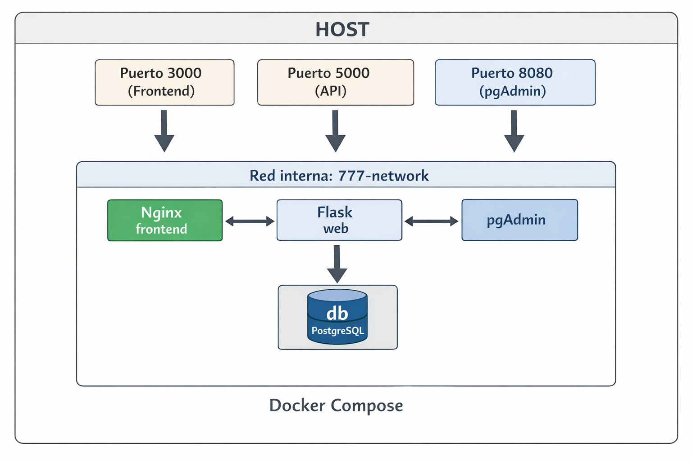

## Requisitos Previos

- Docker Engine 20.10+
- Docker Compose 2.0+

Verificamos que Docker y Docker Compose están correctamente instalados:

```bash
docker --version
docker compose version
````

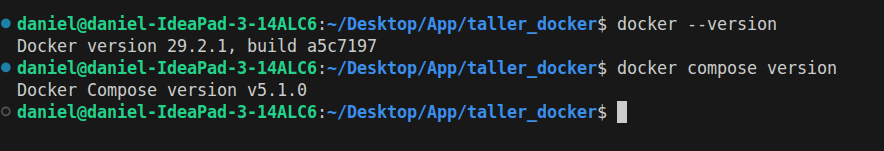

---

## Configuración

Las variables de entorno se encuentran en el archivo `.env`:

```env
# Configuración PostgreSQL
POSTGRES_USER=prueba
POSTGRES_PASSWORD=prueba_pass
POSTGRES_DB=biblioteca_db
DB_HOST=db
DB_PORT=5432
# Configuración pgAdmin
PGADMIN_DEFAULT_EMAIL=admin@biblioteca.com
PGADMIN_DEFAULT_PASSWORD=admin_pass
```

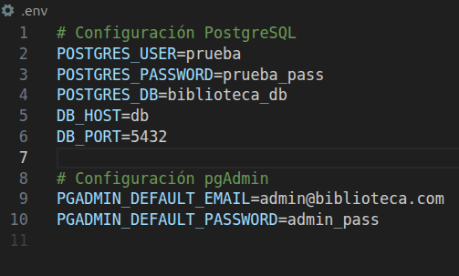

---

## Instrucciones de Uso

### 1. Construimos y levantamos el stack

```bash
docker-compose up --build
```

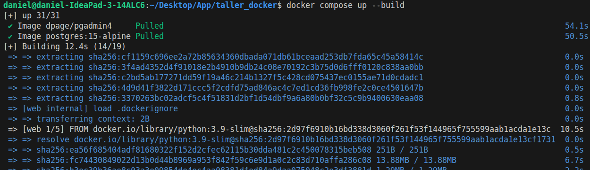

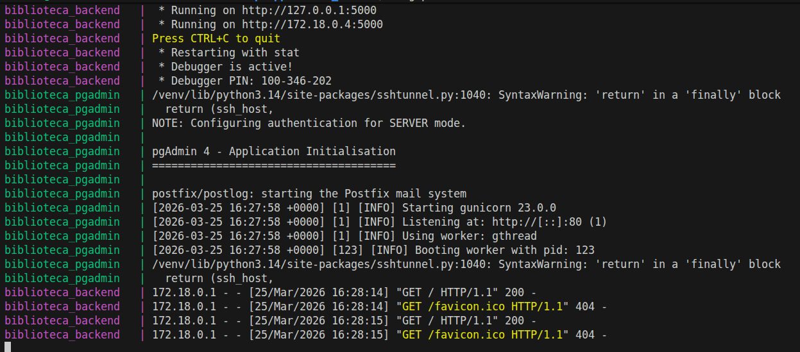

---

### 2. Verificamos el estado de los servicios

```bash
docker-compose ps
```

Debería mostrar todos los servicios en estado `running` o `healthy`.

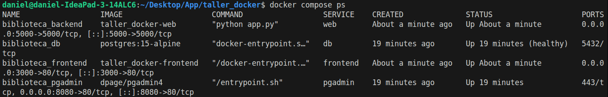

---

### 3. Accedemos a los servicios

| Servicio | URL                                            | Credenciales                                                     |
| -------- | ---------------------------------------------- | ---------------------------------------------------------------- |
| Frontend | [http://localhost:3000](http://localhost:3000) | -                                                                |
| API REST | [http://localhost:5000](http://localhost:5000) | -                                                                |
| pgAdmin  | [http://localhost:8080](http://localhost:8080) | [admin@biblioteca.com](mailto:admin@biblioteca.com) / admin_pass |

#### Frontend ([http://localhost:3000](http://localhost:3000))

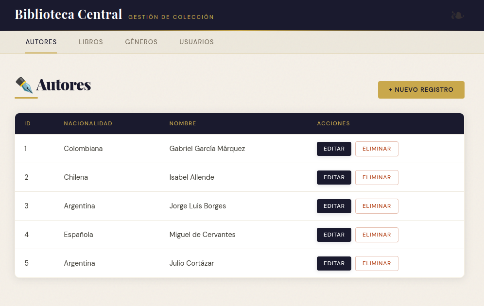

#### API REST ([http://localhost:5000](http://localhost:5000))

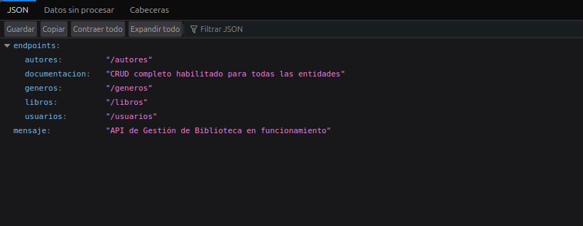

#### pgAdmin ([http://localhost:8080](http://localhost:8080))

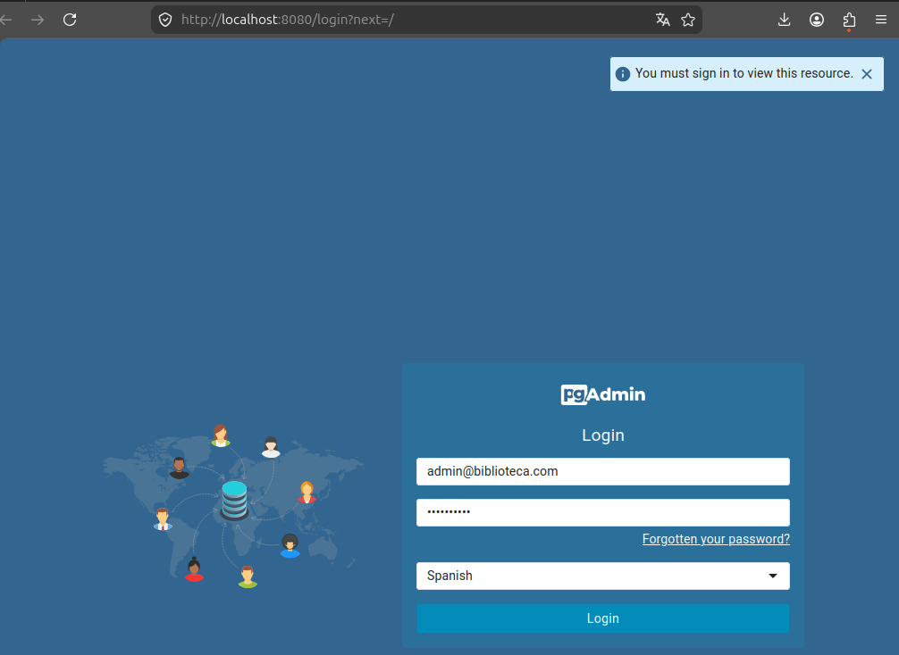

---

### 4. Detenemos el stack (sin eliminar volúmenes)

```bash
docker-compose down
```

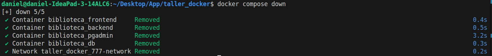

---

### 5. Reiniciamos desde cero (elimina datos)

```bash
docker-compose down -v
docker-compose up --build
```

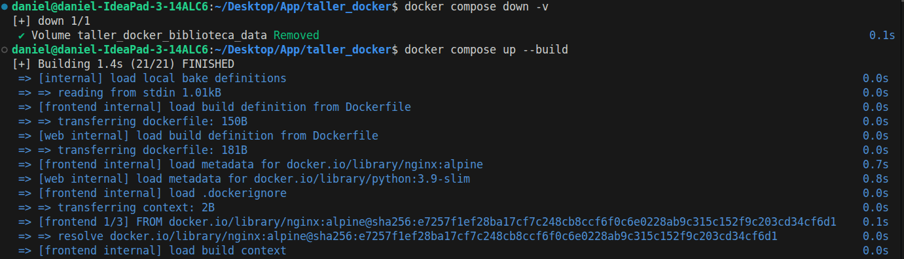

---

### 6. Vemos logs de un servicio específico

```bash
docker-compose logs -f web
```

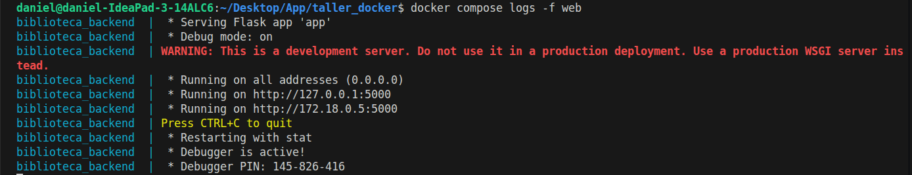

---

## API Endpoints

La API REST proporciona las siguientes entidades:

### Autores

* `GET /autores` - Listar todos los autores
* `GET /autores/<id>` - Obtener un autor específico
* `POST /autores` - Crear un nuevo autor
* `PUT /autores/<id>` - Actualizar un autor
* `DELETE /autores/<id>` - Eliminar un autor

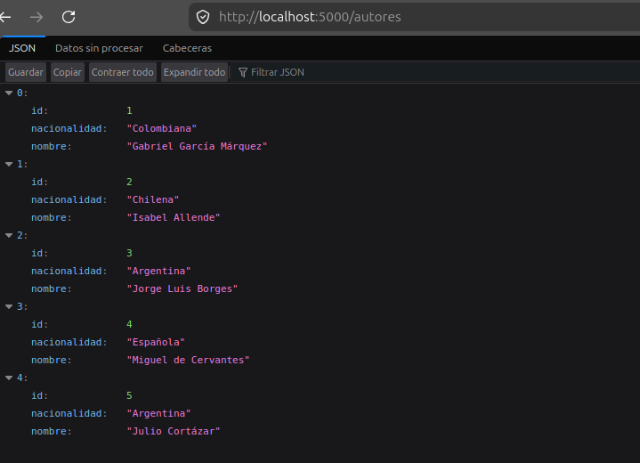

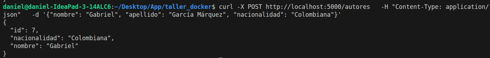

---

### Libros

* `GET /libros` - Listar todos los libros
* `POST /libros` - Crear un nuevo libro
* `PUT /libros/<id>` - Actualizar un libro
* `DELETE /libros/<id>` - Eliminar un libro

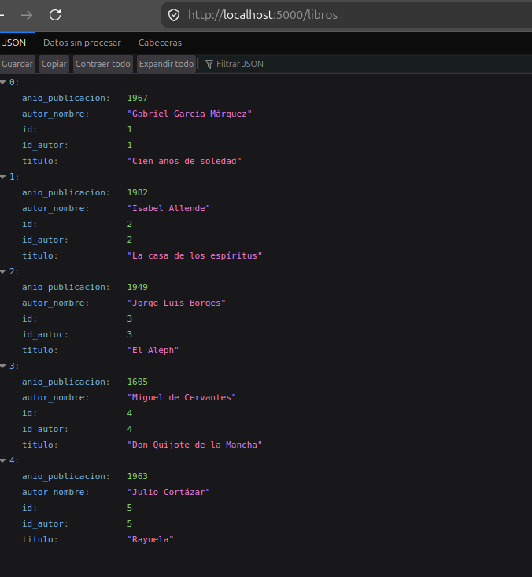

---

### Géneros

* `GET /generos` - Listar todos los géneros
* `POST /generos` - Crear un nuevo género
* `PUT /generos/<id>` - Actualizar un género
* `DELETE /generos/<id>` - Eliminar un género

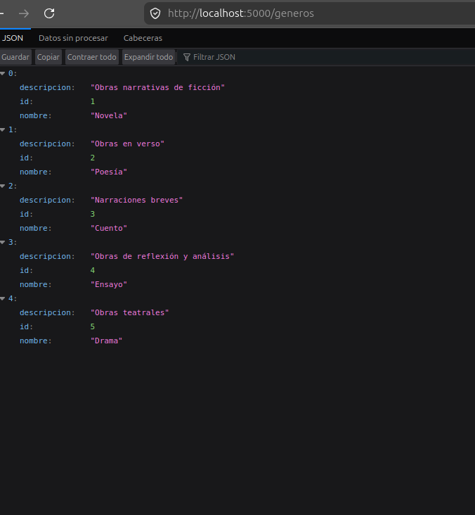

---

### Usuarios

* `GET /usuarios` - Listar todos los usuarios
* `POST /usuarios` - Crear un nuevo usuario
* `PUT /usuarios/<id>` - Actualizar un usuario
* `DELETE /usuarios/<id>` - Eliminar un usuario

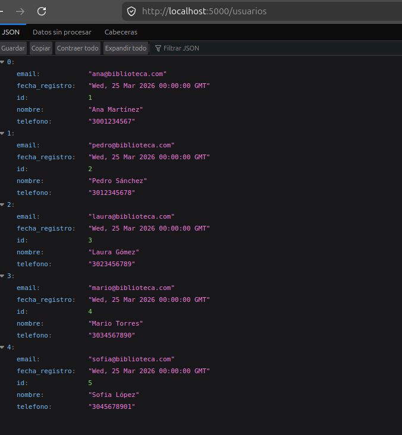

---

## Capturas de Pantalla

### 1. Servicios ejecutándose

```
docker-compose ps
```

Debería mostrar:

* biblioteca_db        → running (healthy)
* biblioteca_backend    → running
* biblioteca_pgadmin    → running
* biblioteca_frontend   → running

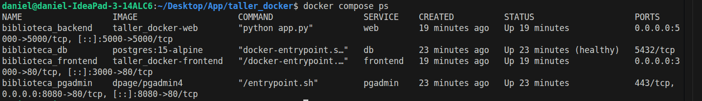

---

### 2. API respondiendo

```bash
curl http://localhost:5000/
```

Respuesta esperada:

```json
{
  "mensaje": "API de Gestión de Biblioteca en funcionamiento",
  "endpoints": {
    "autores": "/autores",
    "libros": "/libros",
    "generos": "/generos",
    "usuarios": "/usuarios",
    "documentacion": "CRUD completo habilitado para todas las entidades"
  }
}
```

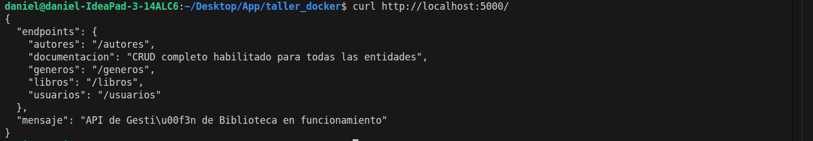

---

### 3. Frontend funcionando

Accedemos a [http://localhost:3000](http://localhost:3000) y verificamos que:

* Se muestra la interfaz de la Biblioteca Central
* Hay pestañas para Autores, Libros, Géneros y Usuarios
* Se pueden ver los datos en tablas
* Los botones "Nuevo registro" y "Editar" funcionan

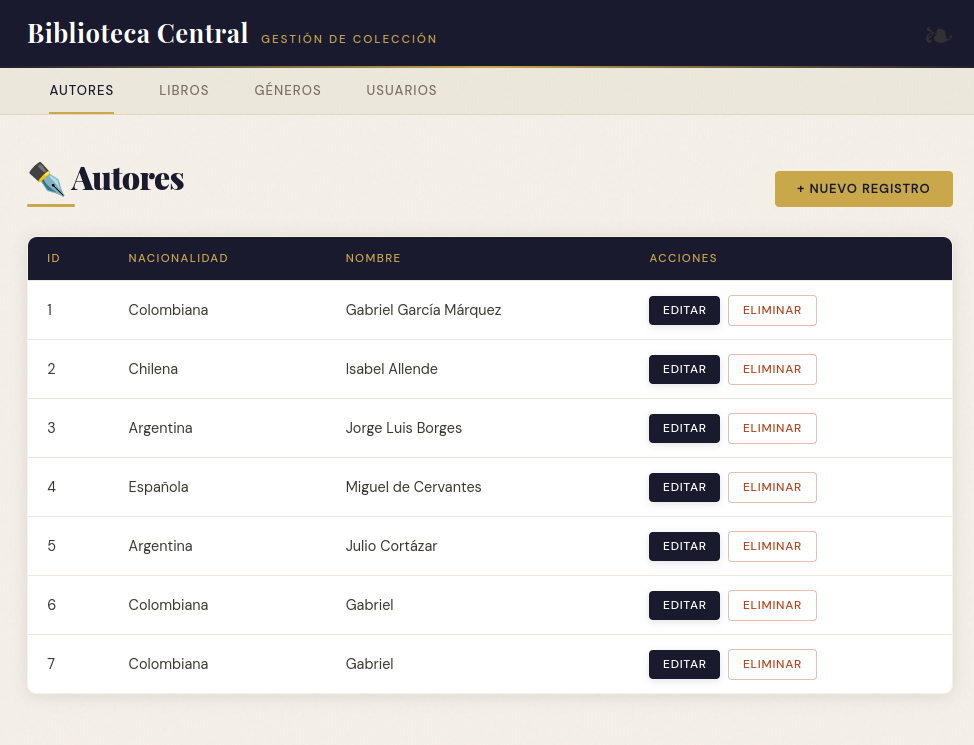

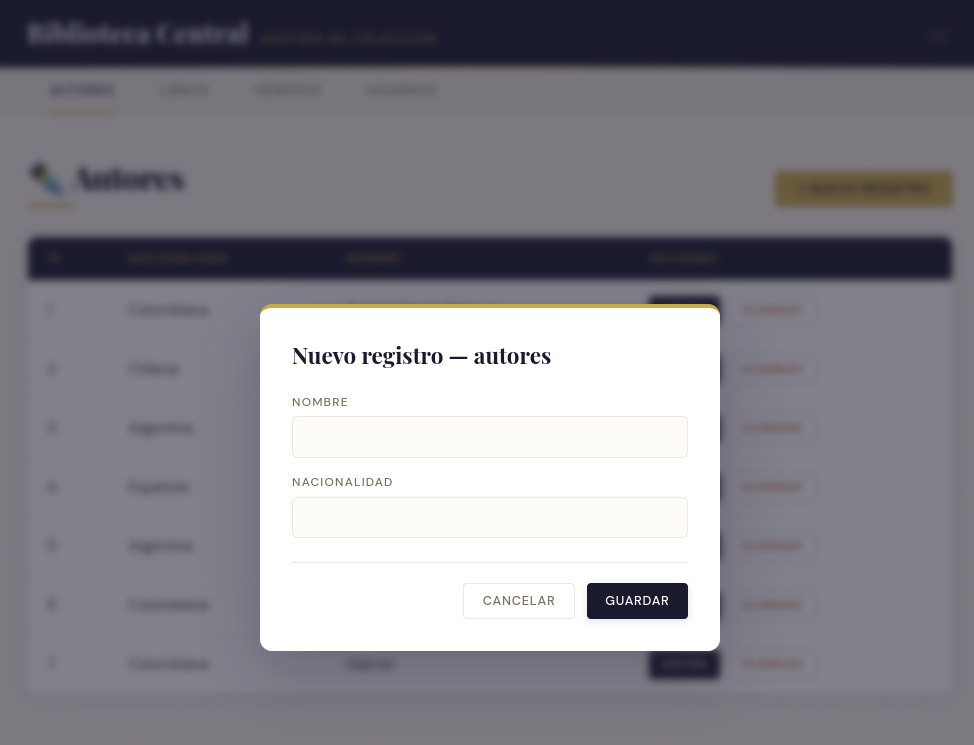

---

### 4. pgAdmin conectado

Accedemos a [http://localhost:8080](http://localhost:8080) e iniciamos sesión con:

* Email: [admin@biblioteca.com](mailto:admin@biblioteca.com)
* Contraseña: admin_pass

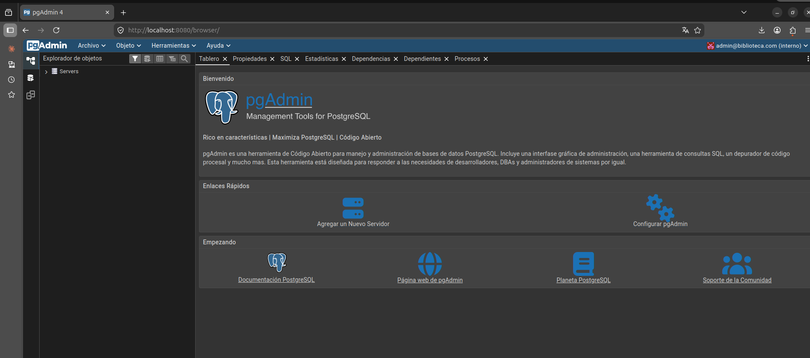

Conectamos al servidor PostgreSQL:

* Host: db
* Puerto: 5432
* Usuario: prueba
* Contraseña: prueba_pass
* Base de datos: biblioteca_db

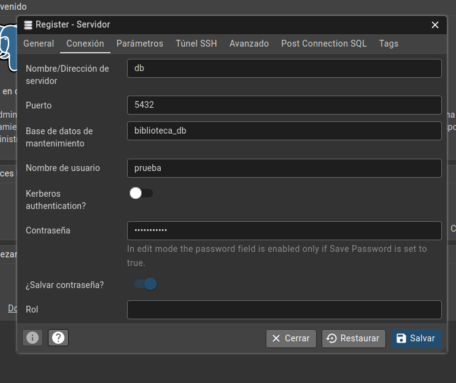

Verificamos que existen las tablas: `autores`, `libros`, `prestamos`, `generos`, `usuarios`.

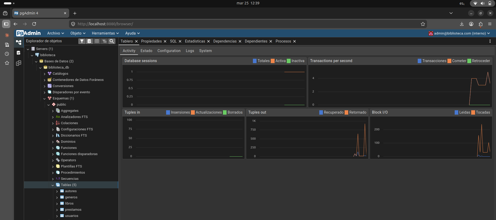

---

## Estructura del Proyecto

```
taller_docker/
├── .env                           # Variables de entorno
├── docker-compose.yml            # Orquestación de servicios
├── README.md                      # Documentación
├── app/
│   ├── Dockerfile                 # Dockerfile de Flask
│   ├── app.py                     # Código de la API REST
│   ├── requirements.txt           # Dependencias de Python
│   └── init-db/
│       └── 01-init.sql            # Script de inicialización de DB
└── frontend/
    ├── Dockerfile                 # Dockerfile de Nginx
    ├── nginx.conf                 # Configuración de proxy inverso
    └── index.html                 # Interfaz de usuario
```

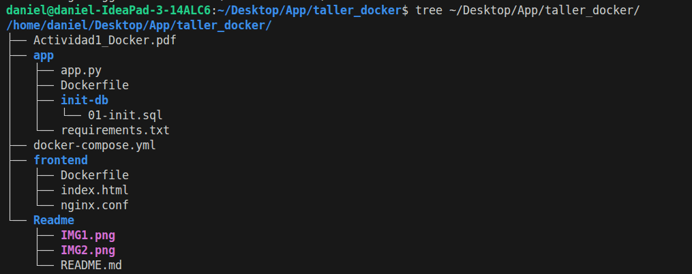

---

## Base de Datos

El script de inicialización crea las siguientes tablas:

1. **autores** - Información de autores (id, nombre, nacionalidad)
2. **libros** - Catálogo de libros (id, titulo, id_autor, anio_publicacion)
3. **prestamos** - Registro de préstamos (id, id_libro, nombre_usuario, fecha_prestamo)
4. **generos** - Géneros literarios (id, nombre, descripcion)
5. **usuarios** - Usuarios registrados (id, nombre, email, telefono, fecha_registro)

Las relaciones entre tablas se establecen mediante claves foráneas:

* `libros.id_autor` → `autores.id`
* `prestamos.id_libro` → `libros.id`

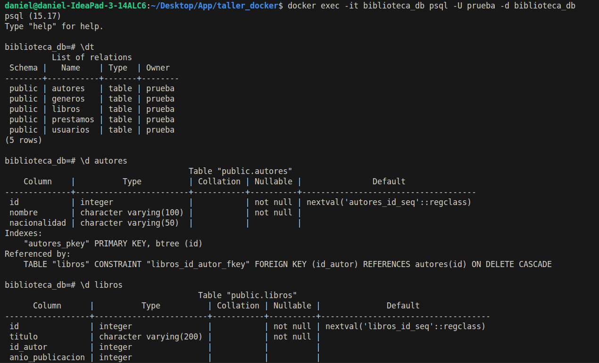

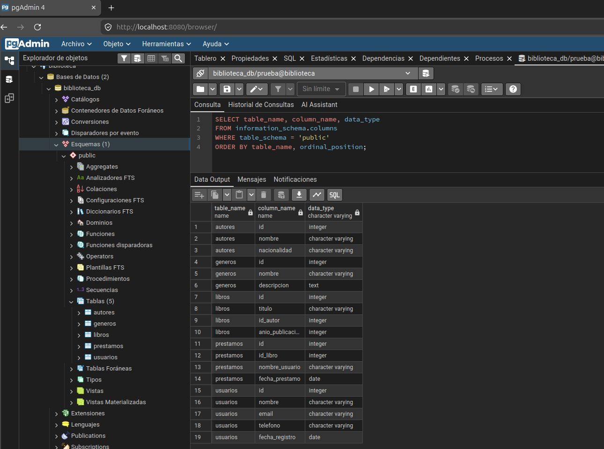

---

## Buenas Prácticas Implementadas

* ✅ Credenciales almacenadas únicamente en archivo `.env`
* ✅ Contenedor de base de datos sin puertos expuestos al host
* ✅ Nombres de contenedores explícitos
* ✅ Healthcheck para garantizar que la DB esté lista
* ✅ Uso de `depends_on` con `condition: service_healthy`
* ✅ Red y volúmenes nombrados explícitamente

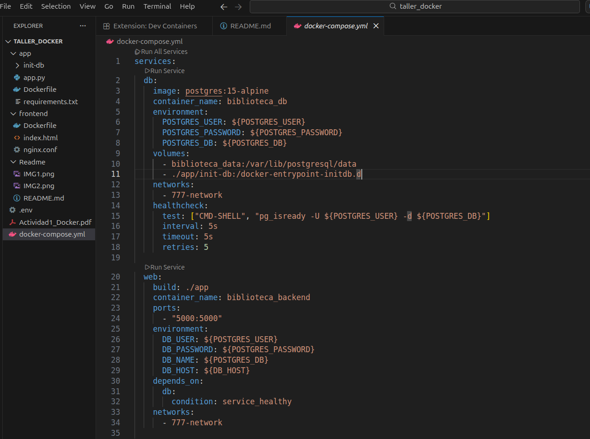

---

```
```
